# CoLibri Architecture

This document describes the architecture of CoLibri (COntext LIBRary), a local RAG system for technical books and notes.

## Table of Contents

- [System Overview](#system-overview)
- [Component Architecture](#component-architecture)
- [Data Flow](#data-flow)
- [Key Processes](#key-processes)
- [Data Model](#data-model)
- [Deployment Architecture](#deployment-architecture)
- [Technology Stack](#technology-stack)

## System Overview

CoLibri is a local-first RAG (Retrieval-Augmented Generation) system for searching a personal library of technical books and notes. The system converts PDF and EPUB files to Markdown, indexes content for semantic search, and exposes retrieval via:

- **CLI** (primary; great for coding-focused “tool-using” agents)
- **MCP server** (for Claude Desktop/Code integrations)
- **REST API** (for non-MCP automation)

### Design Principles

1. **Local-First** - All processing happens locally; no cloud dependencies
2. **Source Agnostic** - Works with plain markdown folders and Obsidian vaults
3. **Minimal Infrastructure** - No external databases or services required
4. **Multiple Interfaces** - CLI-first, with optional MCP and REST
5. **Incremental by Default** - Only re-index what has changed

### High-Level Architecture

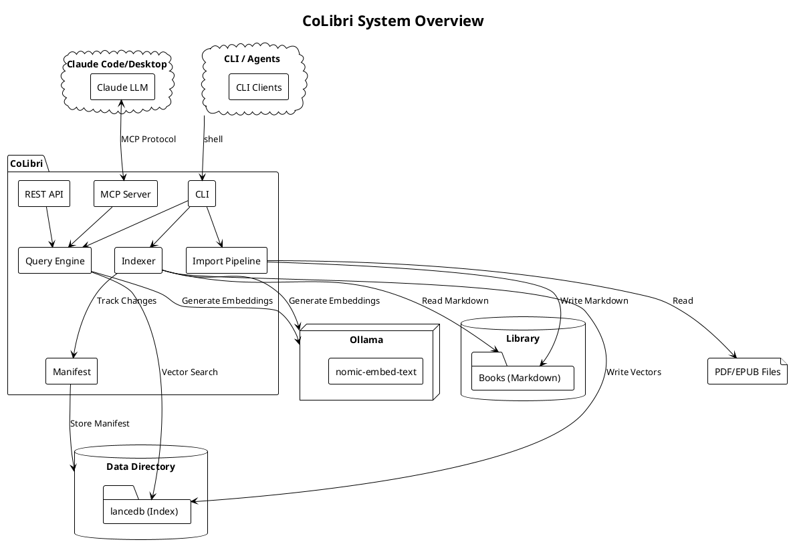

## Component Architecture

### Core Components

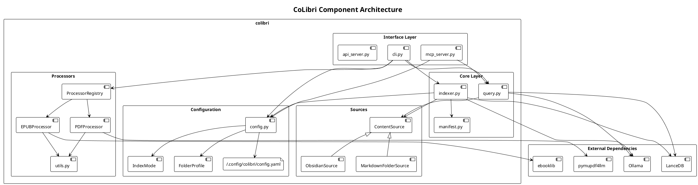

### Component Responsibilities

| Component | File(s) | Responsibility |
|-----------|---------|----------------|
| **CLI** | `cli.py` | Command-line interface, user interaction |
| **MCP Server** | `mcp_server.py` | Claude integration via Model Context Protocol |
| **REST API** | `api_server.py` | HTTP API for Copilot and external clients |
| **Query Engine** | `query.py` | Semantic search, result ranking |
| **Indexer** | `indexer.py` | Document chunking, embedding generation, incremental index management |
| **Manifest** | `manifest.py` | Change tracking via mtime + SHA-256 hash |
| **Config** | `config.py` | Configuration loading, `IndexMode` enum, `FolderProfile` dataclass |
| **Processor Registry** | `processors/registry.py` | Auto-discovery and routing of format handlers |
| **PDF Processor** | `processors/pdf.py` | PDF to Markdown extraction |
| **EPUB Processor** | `processors/epub.py` | EPUB to Markdown extraction |
| **Processor Utils** | `processors/utils.py` | Shared text cleaning, frontmatter generation |
| **Content Source** | `sources/base.py` | Abstract interface for content sources |
| **Obsidian Source** | `sources/obsidian.py` | Obsidian-compatible source adapter (wiki links, frontmatter) |
| **Markdown Source** | `sources/markdown.py` | Plain markdown folder adapter |

## Data Flow

### Import Flow

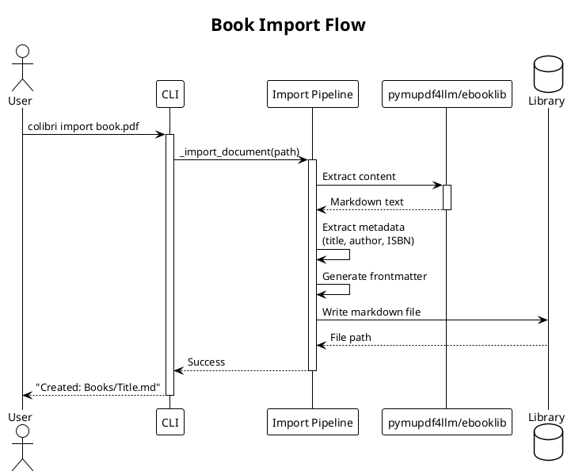

### Indexing Flow

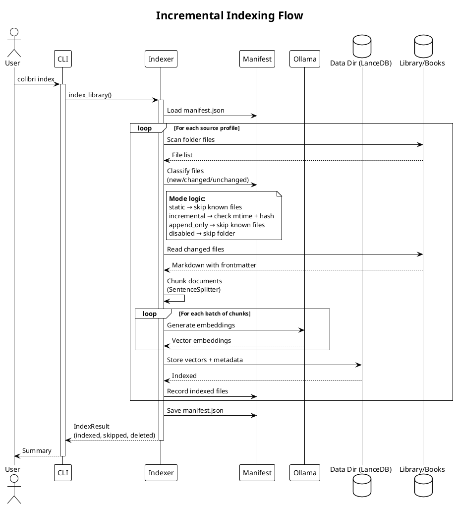

### Search Flow (MCP)

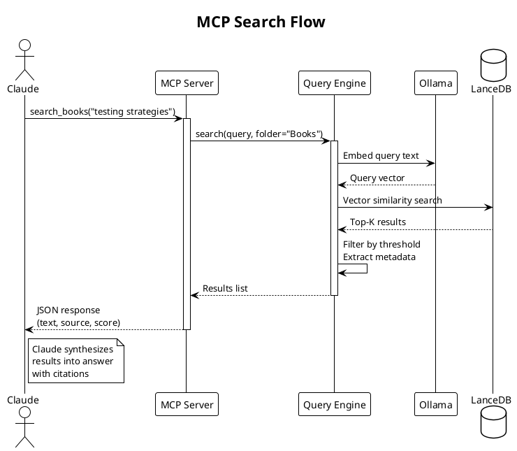

### REST API Search Flow (Copilot)

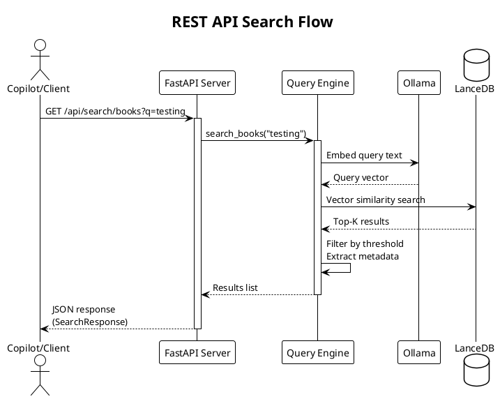

### Complete Request Flow

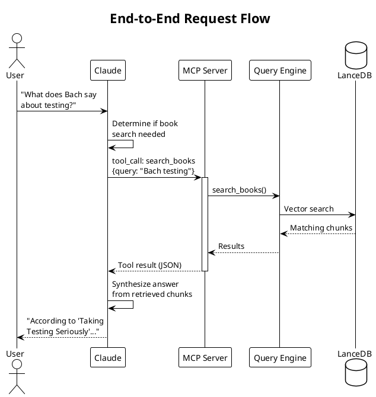

## Data Model

### Markdown Document Format

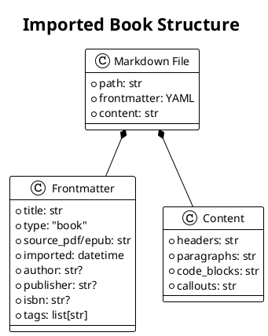

### Vector Index Schema

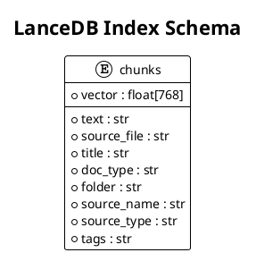

### Manifest Schema

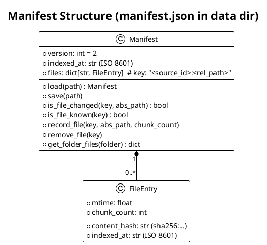

### Configuration Schema

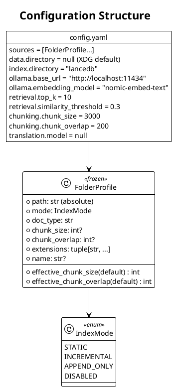

## Deployment Architecture

### Local Deployment

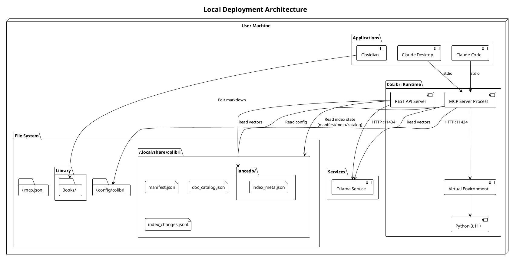

### Process Architecture

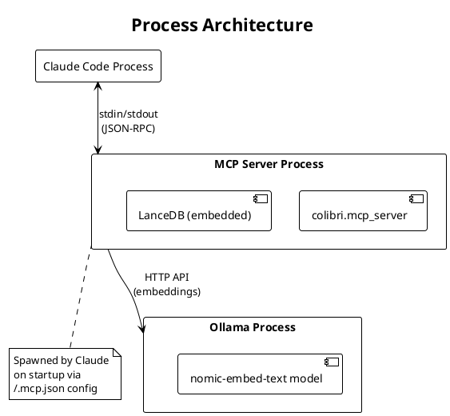

## Technology Stack

### Dependencies

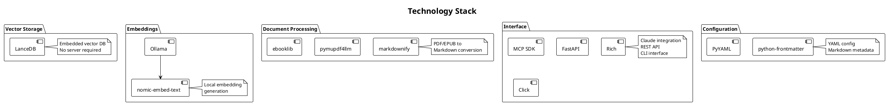

### Version Requirements

| Component | Version | Purpose |
|-----------|---------|---------|
| Python | >=3.11 | Runtime |
| LanceDB | >=0.17.0 | Vector storage |
| Ollama | >=0.5.x | Embedding service |
| MCP SDK | >=1.0.0 | Claude integration |
| FastAPI | >=0.115.0 | REST API server |

## Security Considerations

### Data Privacy

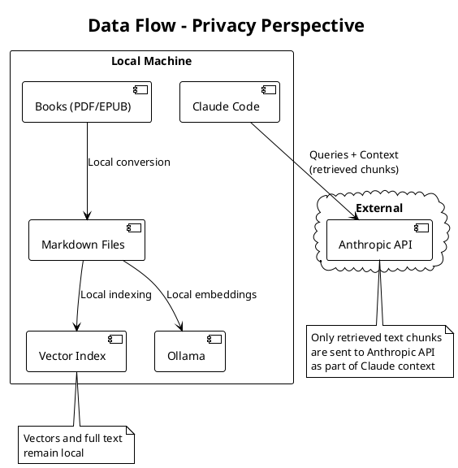

### Key Security Points

1. **Local Processing** - All document processing and embedding generation happens locally
2. **No Cloud Storage** - Book content and vectors are stored only on local filesystem
3. **Selective Context** - Only relevant chunks (not full books) are sent to Claude API
4. **Separate Data** - Index and manifest are stored in a separate data directory (`~/.local/share/colibri/`), not inside the library

## Future Considerations

### Potential Enhancements

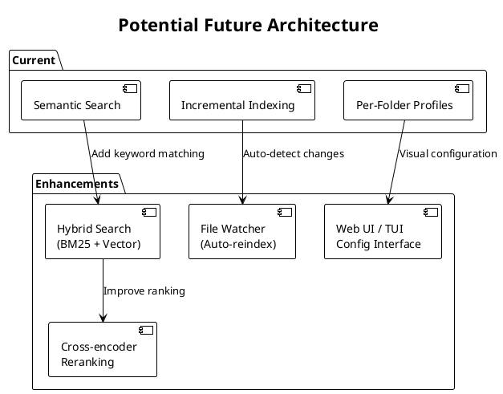

| Enhancement | Complexity | Impact |
|-------------|------------|--------|
| Hybrid Search (BM25) | Medium | Better keyword matching |
| Cross-encoder Reranking | Medium | Improved result ordering |
| File Watcher | Medium | Auto-reindex on changes |
| Web UI / TUI Config | Medium | Visual profile management |
